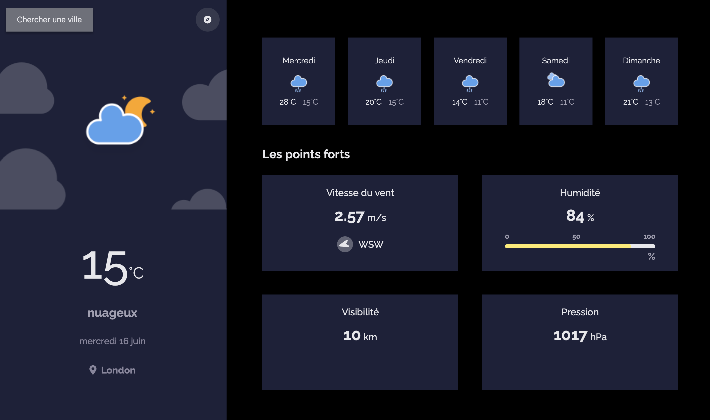

<h1 >Application Météo</h1>

   Inspiré d'un challenge de <a href="http://devchallenges.io" target="_blank">Devchallenges.io</a>. C'était à faire
    avec un Framework front, mais je l'ai entièrement écrite en JavaScript.

  Les données proviennent de l'API de <a href ="https://openweathermap.org">OpenWeather</a>. Il est à noter que les prévisions ne collent pas 
   pas exactement à ce que vous avez par exemple dans votre météo sur votre smartphone, dû au fait que l'offre gratuite de l'API,
    que j'utilise, fait beaucoup trop d'approximations.</a>  

  <a href = "https://yousoumar.github.io/js-weather-app/"></img></a>
  

