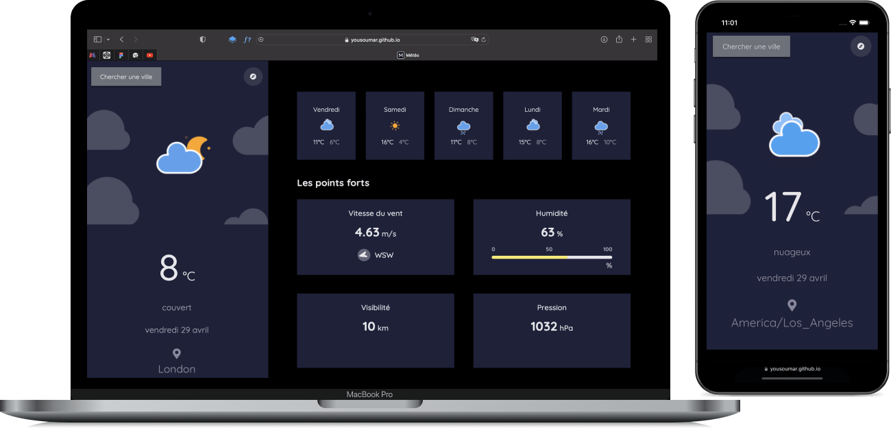

## Weather app

Mobile first and responsive, this application has been produced with great care. It is developed under `webpack` with `HTML`, `CSS` and `JavaScript`. The data, quite approximate, comes from <a href ="https://openweathermap.org"> OpenWeather </a>'s API, with a good management of `errors`.

</img>
